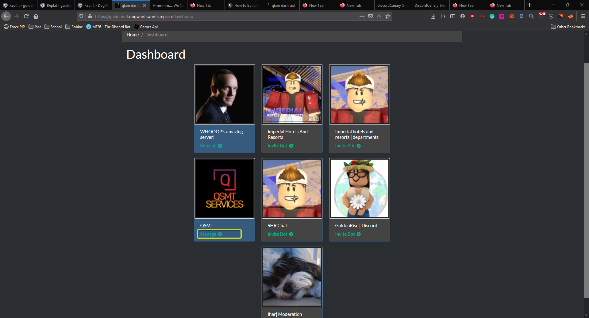

# xEon setup

## Logon to your the\(https://xeon.qsmtrblx.xyz\)

And boom, you're done!

## The configs

| Setting name | Info | Content |
| :--- | :--- | :--- |
| Prefix | The prefix for the bot \(in you're server\) | Prefix |
| modRole | The name of the moderator roles | Mode role name |
| systemNotice | If the bot says if they dont not have permission to run the command | true or false |
| welcomeChannel | The welcome channel | welcome channel id |
| welcomeMessage | The message for the welcome message | Message %USER% to ping user, and %COUNT% for member count of the discord server |
| welcomeEnabled | If the system is enabled | true or false |
| discordmodlogs | If the discord mod logs are enabled | true or false |
| discordmodlogschannel | The channel for discord mod logs | logs channel id |
| robloxlogchannelid | The channel for roblox logs | logs channel id |
| groupid | The id of the roblox group for the server | Roblox id here |
| firedrank | The rank to set user to when fired | Rank id |
| footer | The footer of some of the bots embeds | Footer text here |
| robloxlogchannel | If the roblox log channel is enabled | true or false |

